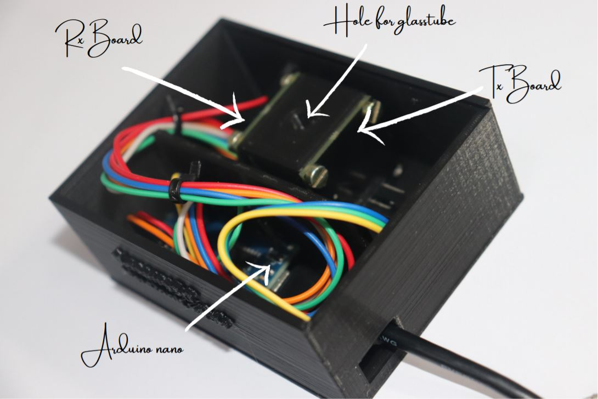
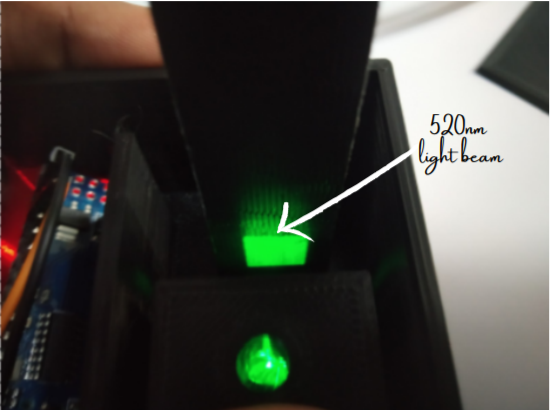
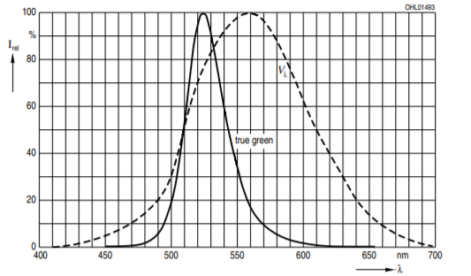
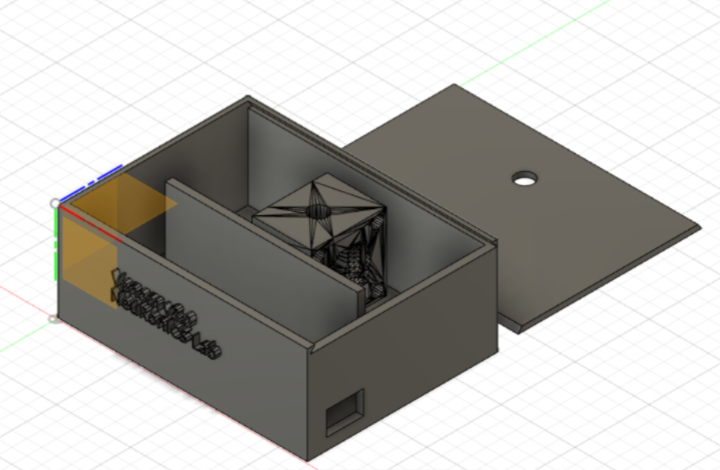
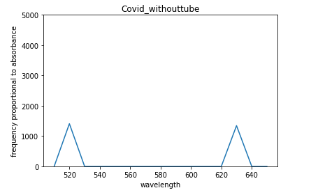
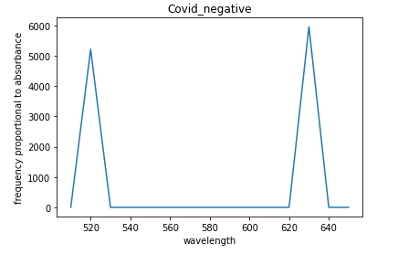

# pointSpectra
pointSpectra is a low-cost, open-source alternative for measuring absorbance of the analyte at specific wavelengths of light. This project is initially made to detect various snake species venom in human blood to do a one-to-one mapping of venom and the snake species using Venom Detection Kit. Nevertheless, it  can be used for any analyte.

> 
The whole setup can be built with BOM cost not more than 1000 INR i.e. 15 USD.

# Background

pointSpectra works on the Beer-Lambert law which states that the quantity of light absorbed by a substance dissolved in a fully transmitting solvent is directly proportional to the concentration of the substance and the path length of the light through the solution. The below is the formulation for absorbance of an analyte: 

**Transmittance:**
`T = I / I0`
`% Transmittance: %T = 100 T`

**Absorbance:**
`A = log10 (I0/I)`
`A = log10 (1/T) = -log10 (T)`
`A = log10 (100/%T)`
`A = 2 - log10 (%T)`

# Requirements

**Hardware requirements:**
- [Arduino nano](https://store.arduino.cc/usa/arduino-nano) or [any small form factor arduino](https://store.arduino.cc/usa/arduino/boards-modules)
- [Tx and Rx boards](https://github.com/HemanthSabbella/pointSpectra/tree/main/Tx_Rx_boards%20V1.0)

**Software requirements:**
- [Arduino IDE](https://www.arduino.cc/en/software/)
- [Firmware](https://github.com/HemanthSabbella/pointSpectra/tree/main/firmware)

**Mechanical requirements:**
- [3D-printed case](https://github.com/HemanthSabbella/pointSpectra/tree/main/3D_printed_casing)
- A glass testtube of diameter 5mm.
- Four M3 screws.

# Making 
The setup mainly invoves three boards - Tx Board, Rx Board and Arduino nano. Tx board has wavelength-specific LED emitters that goes through mechanical slits of the the 3D printed case in which a glass tube is inserted orthogonally and the unabsorbed light beams coming through the tube fall on Rx board which has photo diode array that converts the light intensity into propotional frequency. This signal is caputured by the nano-microcorntoller, further processing of the data is done and it's followed by plotting the absorbance graph.  

> 

**Tx Board:** 
- Use narrow-band, dominant wavelength LEDs as light sources for a specific wavelength absorbance. 
- 6-point light sources. 

Spectral Response of LEDs: 

> 
> 

**Rx Board:**

- TCS3200 - Light (irradiance) to frequency converter. 
- 8 x 8 array of photodiodes. 
- 16 blue filters, 16 green filters, 16 red filters and 16 clear filters. 
- The output is a square wave (50% duty cycle) with frequency directly proportional to luminous intensity (irradiance).

Functional Block Diagram: 

> 
> 

**3D printed case:**

Use the [cheet sheet](https://github.com/HemanthSabbella/pointSpectra/blob/main/docs/img/3d_print_CS.PNG) of if you are not familiar with 3D printing.  
> 

**Pin connections:**

| Tx | Arduino nano|
|------|---------|
| LED_520 | D11 |
| LED_560 | D3 |
| LED_600 | D4 |
| LED_630 | D10 |
| LED_660 | D2 |
| GND | GND |
  
| Rx | Arduino nano|
|--------|---------|
| S0 | D5 |
| S1 | D6 |
| S2 | D7 |
| S3 | D8 |
| sensorOut | D9 |

# Firmware
 The firmware code makes the luminous intensity of LEDs same by adjusting the average current to the LEDs using Pulse Width Modulation (PWM) signals. Standard signal conditioning and calibration techniques like zero referencing and range mapping are used. It outputs an absorbance graph of an analyte by interpolating the sensor reading of 6 narrow band LED inputs. Flash the [Firmware](https://github.com/HemanthSabbella/pointSpectra/tree/main/firmware) using [Arduino IDE](https://www.arduino.cc/en/software/). 
 
# Results 
 We have measured the absorbance of gold nanoparticles with COVID-19 positive and negative samples at 520nm and 630nm and repeated it a couple of times, the results are as below: 
>   
>   
> 

> pointSpectra is developed in [NeuRonICS lab](https://labs.dese.iisc.ac.in/neuronics/), DESE, IISc. For any clarification and details about replication please contact the author at hemanthrs@iisc.ac.in
